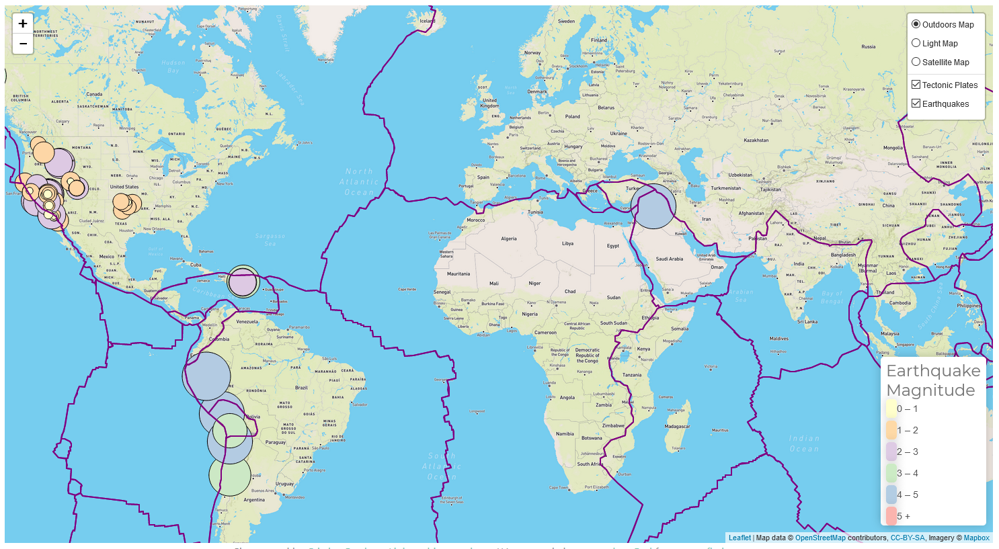
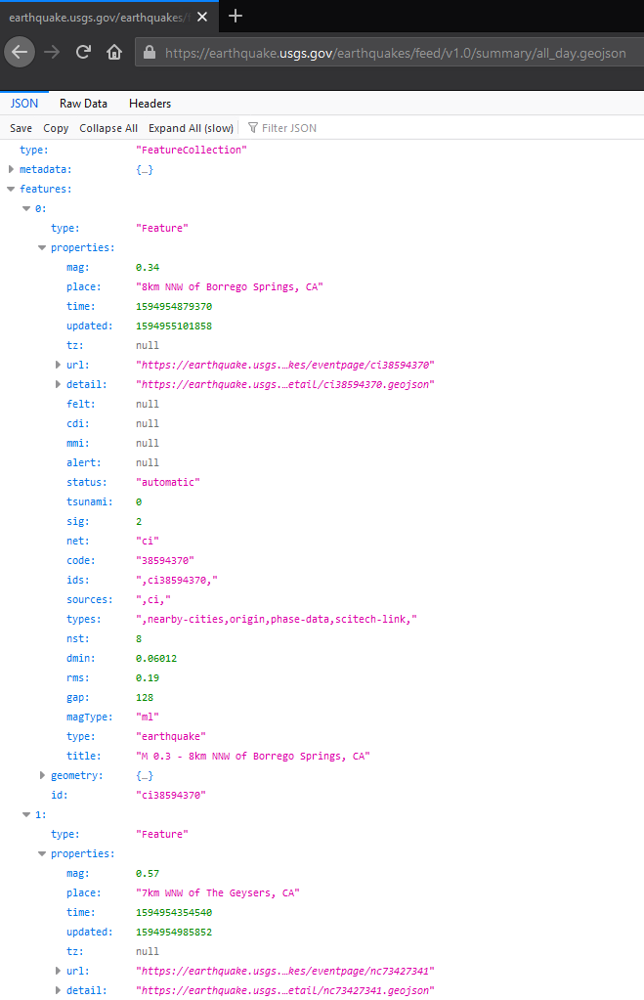
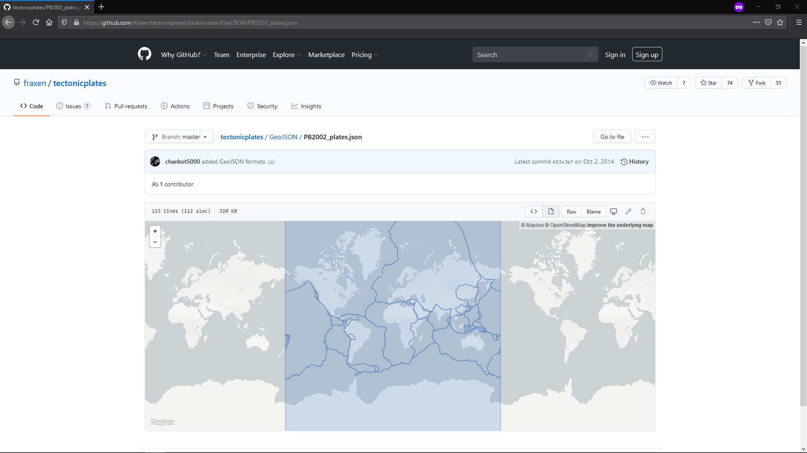

# [Earthquakes in the last 24hrs from United States Geological Survey (USGS)](https://cckuqui.github.io/24hrs-earthquakes/)

## Data

The United States Geological Survey, or USGS for short, is responsible for providing scientific data about natural hazards, the health of our ecosystems and environment; and the impacts of climate and land-use change. They collect a massive amount of data from all over the world each day and update their information frequently. For this exercise with Leaflet, I used their geojson data from all the earthquakes in the last 24hrs.

Also, I wanted to add a second dataset to visualize the relationship between the tectonic plates and the seismic activity. For that I used data found [here](https://github.com/fraxen/tectonicplates.)

### Objectives

* Visualize the earthquakes from the data set.
  * Create a map that plots all of the earthquakes from your data set based on their longitude and latitude.
  * Each data markers should reflect the magnitude of the earthquake in their size and color.
  * Include popups that provide additional information about the earthquake when a marker is clicked.
  * Create a legend that will provide context for your map data.

* Visualize the tectonic plates
  * Plot a second data set on our map.
  * Add a number of base maps to choose from as well as separate out our two different data sets into overlays that can be turned on and off independently.

## Results

### Copyright

Trilogy Education Services © 2019. All Rights Reserved.
